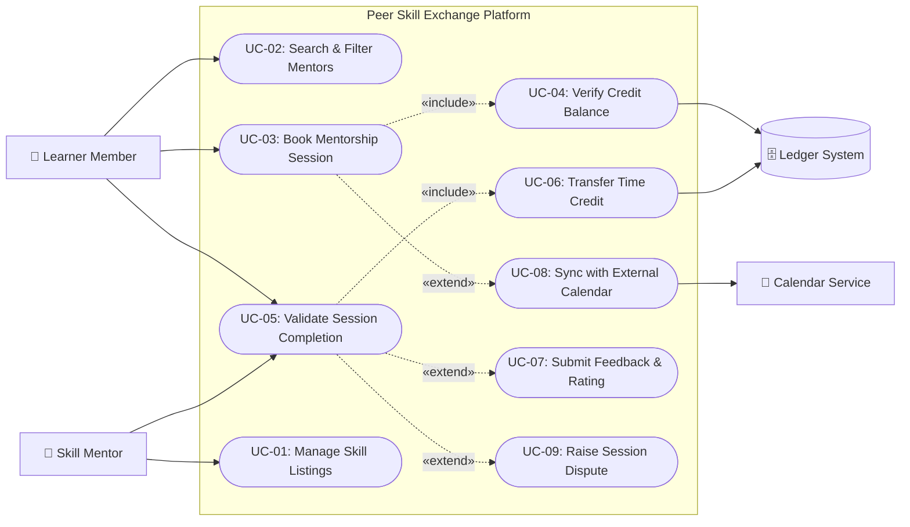

# SE-Lab-1_Activity
PES University - Dept. of CSE - Lab 1: Requirements Engineering &amp; UML Use-Case Modelling (Problem #56)

# SE Lab 1: Requirements Engineering & UML Use-Case Modelling
**Course:** Software Engineering Lab  
**Institution:** PES University - Dept. of CSE  
**Problem Statement #56:** Peer Skill Exchange & Mentorship Network  

---

## 📌 Deliverables Directory
* 📋 **Requirements Specification:** [`docs/Requirements_Specification.md`](docs/Requirements_Specification.md) (5 FRs, 2 NFRs)
* 📐 **Use Case Specification:** [`docs/Use_Case_Specification.md`](docs/Use_Case_Specification.md) (Detailed MSS & Alternate Flows for UC-03)
* 📊 **UML Diagram Source:** [`diagrams/use_case_diagram.puml`](diagrams/use_case_diagram.puml)

---

## 📊 UML Use-Case Diagram

